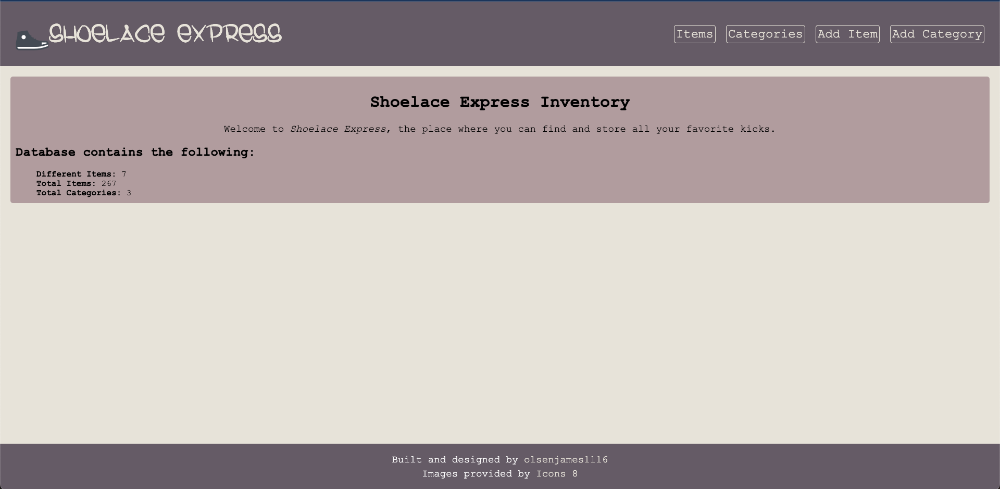
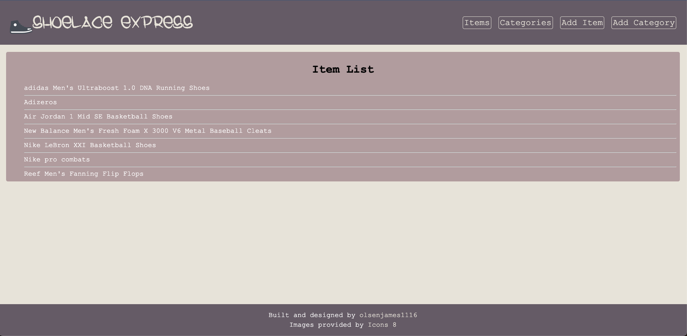
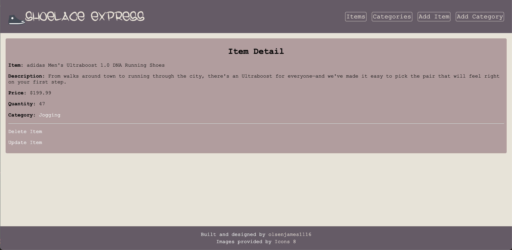
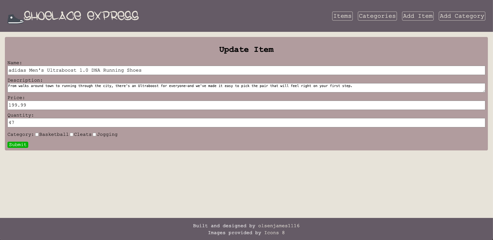
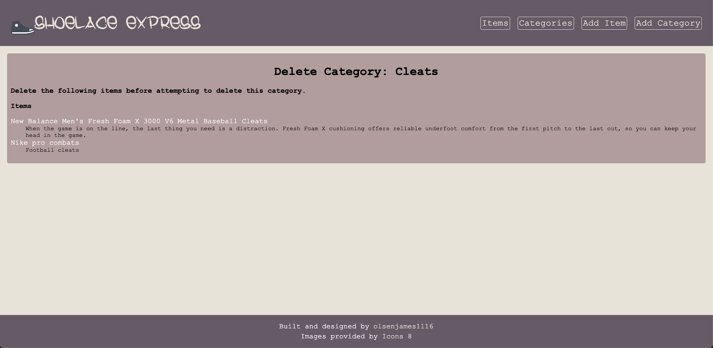

# Shoelace Express

## Previews

Home:

Item List:

Item Detail:

Update Detail:

Delete Category:

## Description

Keep track of all your inventory with this inventory tracking app. Create, read, update and delete items and categories from the database to keep your stock organized and up to date. This project uses shoes to show off its functionality but has the ability to work with any sort of data the user wishes.

This project highlights:

- CRUD operations
- Mongoose/MongoDB
- MVC architecture
- Node.js
- Express
- Server-side routing
